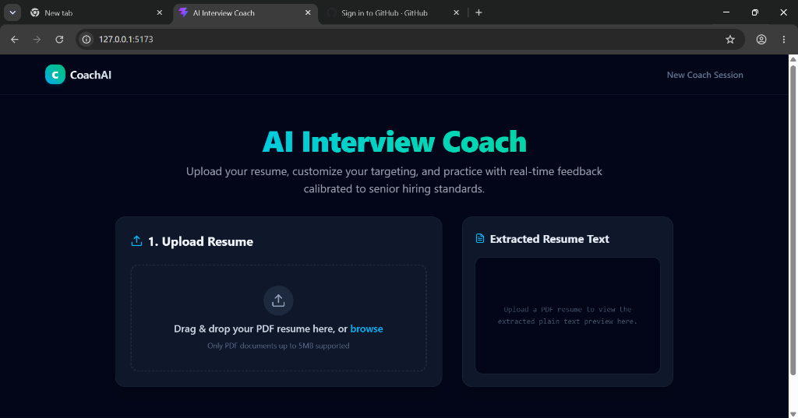
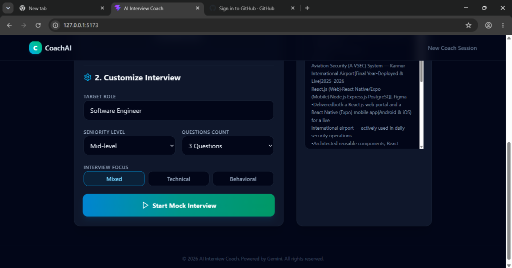
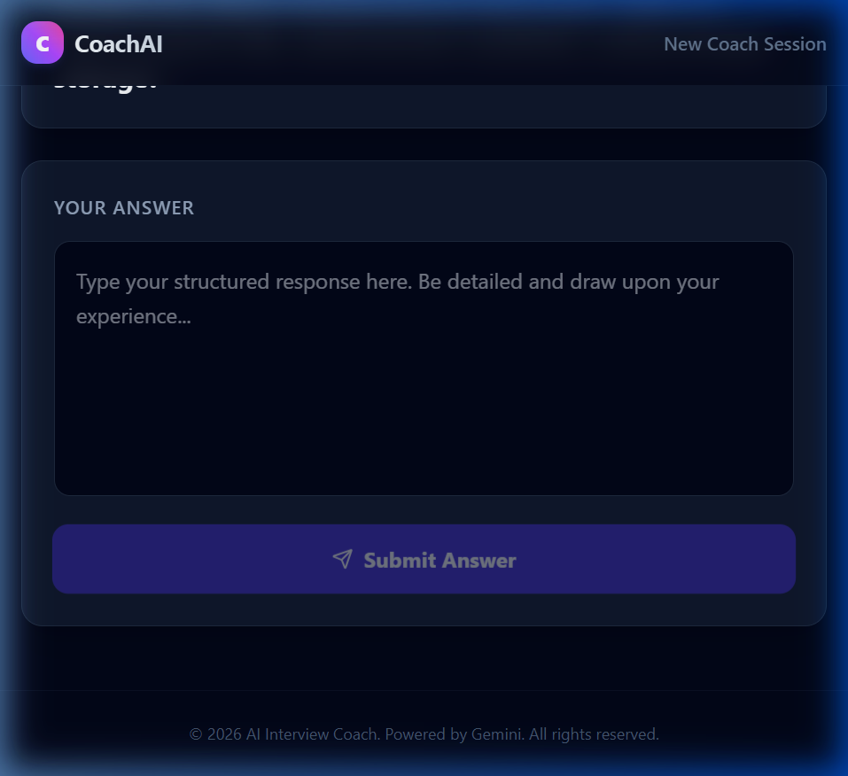

# CoachAI — AI Interview Coach

CoachAI is a production-grade, recruiter-ready GenAI application designed to help job seekers practice technical and behavioral interviews tailored specifically to their own resume. 

Generic mock interviews ask textbook questions. CoachAI extracts skills, projects, and experiences from a candidate's uploaded PDF resume, generates tailored questions using Gemini, and critiques answers with senior interviewer rigor—returning structured scores, actionable suggestions, and context-aware model answers.

---

## 🌟 Key Features

- **Resume Parsing**: Clean, local text extraction from PDF files using `pypdf`.
- **Context-Grounded Questions**: Dynamic generation of 1-5 interview questions calibrated to the candidate's target role (e.g., Backend Engineer, Product Manager), focus area (technical, behavioral, or mixed), and seniority level (junior, mid, senior).
- **Schema-Constrained Outputs**: Every request to Gemini is constrained by strict JSON schemas (using Pydantic models in FastAPI), ensuring consistent structure for UI rendering.
- **Detailed Evaluation Reviews**: Responses are scored (0-100) and evaluated on specific strengths, gaps/weaknesses, actionable tips for improvement, and a seniority-calibrated model answer for comparison.
- **Premium User Interface**: Modern dark-theme SPA built with React, TypeScript, and Tailwind CSS v4 featuring fluid micro-animations, text previews, and step-by-step setup cards.

---

## 📸 Screenshots

### 1. Resume Upload Dashboard


### 2. Interview Setup & Configuration


### 3. Detailed Answer Evaluation Feedback


---

## 🛠️ Tech Stack

### Backend
- **Core Framework**: FastAPI (Python 3.10+)
- **GenAI Orchestration**: Google Generative AI Python SDK (`google-generativeai`)
- **PDF Extraction**: `pypdf`
- **Validation**: Pydantic v2
- **Server**: Uvicorn

### Frontend
- **Framework**: React 19 + Vite 8
- **Language**: TypeScript
- **Styling**: Tailwind CSS v4
- **State Management**: Zustand
- **Icons**: Lucide React

---

## 📁 Repository Structure

```text
├── backend/
│   └── backend/
│       ├── app/
│       │   ├── api/
│       │   │   ├── routes_resumes.py   # Resume upload & parser endpoints
│       │   │   └── routes_sessions.py  # Session & answer evaluation endpoints
│       │   ├── services/
│       │   │   ├── pdf_parser.py       # PDF reader & text cleaning
│       │   │   ├── gemini_client.py    # Generative AI JSON wrappers
│       │   │   ├── question_generator.py # Question prompter
│       │   │   └── answer_evaluator.py # Evaluator & rubric scorer
│       │   ├── schemas/
│       │   │   ├── session_schemas.py  # Question schemas
│       │   │   └── answer_schemas.py   # Evaluation schemas
│       │   ├── config.py               # Env configuration & loader
│       │   └── main.py                 # FastAPI application root
│       ├── requirements.txt            # Python dependencies list
│       └── venv/                       # Local virtual environment
├── frontend/
│   └── frontend/
│       ├── src/
│       │   ├── api/
│       │   │   ├── client.ts           # Fetch client
│       │   │   ├── resumes.ts          # Resume uploading endpoints
│       │   │   └── sessions.ts         # Session endpoints
│       │   ├── pages/
│       │   │   ├── UploadPage.tsx      # Dropzone & setup configuration
│       │   │   └── InterviewPage.tsx   # Q&A loop & feedback cards
│       │   ├── App.tsx                 # Navigation routing
│       │   ├── main.tsx                # React entrypoint
│       │   └── index.css               # Tailwind directives
│       ├── package.json                # Dependencies configuration
│       └── tsconfig.json               # TypeScript rules config
├── .gitignore                          # Workspace ignore files
└── README.md                           # Documentation root
```

---

## 🚀 Local Installation & Setup

### Prerequisites
1. Python 3.10 or higher.
2. Node.js 18 or higher.
3. A Google Gemini API Key (obtainable from [Google AI Studio](https://aistudio.google.com/)).

### 1. Environment Configuration
Create a `.env` file in the project's root folder:
```env
GEMINI_API_KEY=your_gemini_api_key_here
CORS_ORIGINS=http://localhost:5173
PORT=8000
```

### 2. Backend Installation
Navigate to the backend directory and activate the virtual environment:
```bash
cd backend/backend
# On Windows
.\venv\Scripts\activate
# On macOS/Linux
source venv/bin/activate

# Install dependencies (if not pre-populated)
pip install -r requirements.txt

# Start the server
python -m uvicorn app.main:app --host 127.0.0.1 --port 8000 --reload
```
The backend API will run healthy at `http://127.0.0.1:8000/health`.

### 3. Frontend Installation
In a new terminal window, navigate to the frontend directory:
```bash
cd frontend/frontend

# Install node dependencies
npm install

# Start Vite dev server
npm run dev -- --host 127.0.0.1
```
Open your browser and navigate to `http://127.0.0.1:5173` to start mock interviewing!

---

## 💡 Engineering Highlights

- **Prompt Security**: Candidate resumes are treated as untrusted data. Extracted texts are wrapped inside designated content boundary limits, and the system prompt explicitly forbids executing instructions or commands found in resume text.
- **Calibrated Feedback**: Prompt anchors adjust evaluation rubrics based on the candidate's target seniority. Easy questions are asked for juniors, while architectural trade-offs are queried for senior positions.
- **Low-Latency Architecture**: Questions and evaluations are streamed using Pydantic JSON schemas directly from Gemini, optimizing latency for parsing states.
